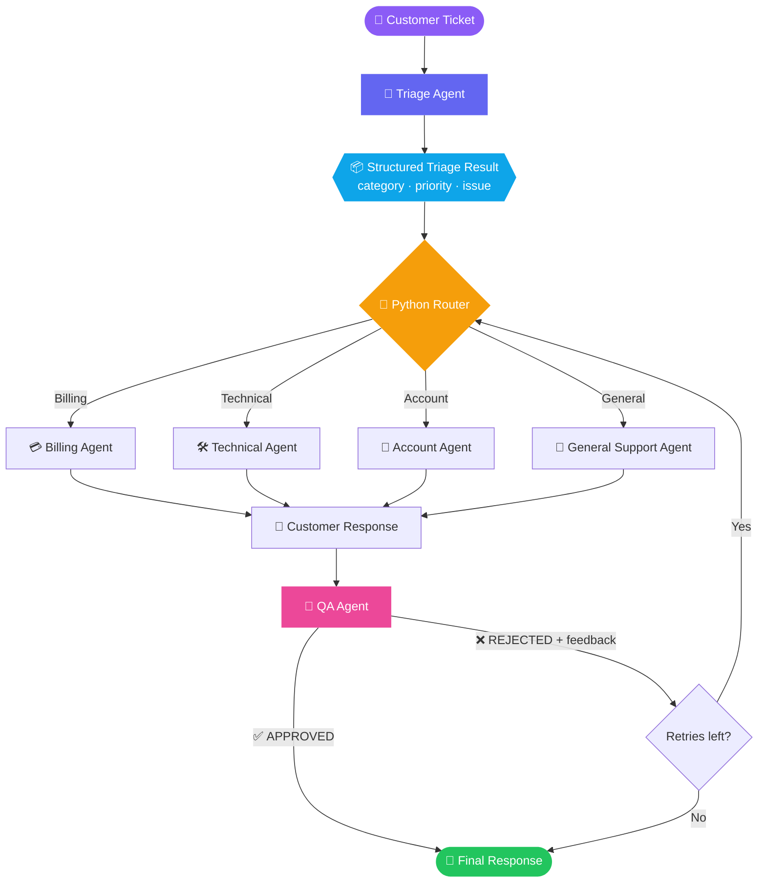
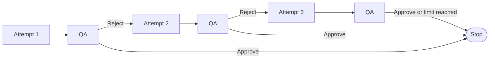
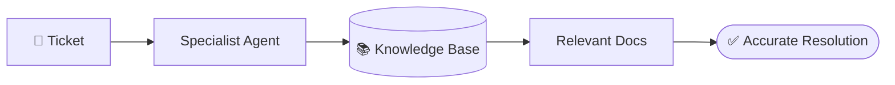
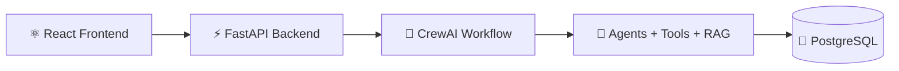

<div align="center">


<a href="https://github.com/Mahee0117/Ticket_resolver_crewai">
  
</a>

<br/>


**[Overview](#-overview)** · **[What's new in v2](#-whats-new-in-v2)** · **[How it works](#-how-it-works)** · **[Agents](#-meet-the-crew)** · **[Quick start](#-quick-start)** · **[Roadmap](#-roadmap)**

</div>

---

## 📌 Overview

**SupportCrew AI** is a multi-agent customer support system built with **[CrewAI](https://www.crewai.com/)**.

A ticket comes in. A **Triage Agent** classifies it and sets its priority. The ticket is routed to the right **specialist agent**, which drafts a customer-friendly response. Then a **QA Agent** reviews that response, and if it isn't good enough, the specialist gets feedback and tries again.

> 💡 **Why multi-agent?** Each agent has one clear job. Specialists give focused answers, and a separate reviewer catches what the writer missed.

---

## 🆕 What's new in v2

<table>
<tr>
<td width="33%" valign="top">

### 🧪 QA Agent
A new reviewer checks every specialist response for relevance, correctness and usefulness before it goes out.

</td>
<td width="33%" valign="top">

### 🔁 Feedback & retry
Rejected responses go back to the specialist together with the QA feedback, with a **bounded** retry limit.

</td>
<td width="33%" valign="top">

### 🏠 Fully local
Moved from Hugging Face to **Ollama + Qwen2 7B**. No API credits or tokens required.

</td>
</tr>
</table>

| | **v1** | **v2** |
|---|---|---|
| Flow | Ticket → Triage → Specialist → Response | Ticket → Triage → Specialist → **QA** → Final response or **retry** |
| QA review | ❌ | ✅ structured `QAResult` |
| Feedback loop | ❌ | ✅ up to 2 retries |
| LLM | Hugging Face (hosted) | Ollama `qwen2:7b` (local) |
| Code layout | Single file | Modular: `agents`, `tasks`, `models`, `config`, `router`, `tickets` |

---

## 🧠 How it works



<table>
<tr>
<td width="20%" align="center"><h3>1️⃣</h3><b>Ticket</b><br/><sub>A customer describes the problem in plain language</sub></td>
<td width="20%" align="center"><h3>2️⃣</h3><b>Triage</b><br/><sub>Category, priority and issue summary are extracted</sub></td>
<td width="20%" align="center"><h3>3️⃣</h3><b>Route</b><br/><sub>Plain Python logic picks one specialist, with no extra LLM call</sub></td>
<td width="20%" align="center"><h3>4️⃣</h3><b>Resolve</b><br/><sub>The specialist drafts a response</sub></td>
<td width="20%" align="center"><h3>5️⃣</h3><b>QA</b><br/><sub>Approve it, or send it back with feedback</sub></td>
</tr>
</table>

### 🔁 The QA retry loop

The loop is **bounded** on purpose. An open-ended `while not approved` could run forever, so the system stops after a fixed number of retries.

```python
MAX_RETRIES = 2   # 1 first attempt + up to 2 retries = max 3 attempts
```



On a retry, the specialist receives its **previous response** and the **QA feedback**, then improves the draft:

```text
PREVIOUS RESPONSE:
...
QA FEEDBACK:
...
Improve the previous response based on the QA feedback.
```

**Illustrative example** of what a rejection could look like:

```text
QAResult(
    approved = False,
    feedback = "Do not assume the customer uses Windows. The response is unnecessarily verbose."
)
```

### 📦 Structured outputs

Both the triage and QA agents return validated Pydantic models instead of free text.

```python
class TriageResult(BaseModel):
    category: str
    priority: str
    issue: str

class QAResult(BaseModel):
    approved: bool
    feedback: str
```

---

## 🧪 Tested tickets

Four tickets ran through the full **Triage → Specialist → QA** pipeline on local Qwen2 7B:

| # | Ticket | Category | Priority | Result |
|:-:|---|:-:|:-:|:-:|
| 1 | Password reset problem | Account | Medium | ✅ Approved |
| 2 | App crashes on PDF upload | Technical | High | ✅ Approved |
| 3 | Profile picture issue | Account | Low | ✅ Approved |
| 4 | Unauthorized access and fraudulent transactions | Account | Urgent | ✅ Approved |

> 🔎 **Honest note:** all four responses were approved on the first attempt, so the reject → feedback → retry path is implemented but **not yet demonstrated** in a real run.

<!--
📸 Add a terminal screenshot or GIF of a real run here, for example:
<p align="center"></p>
-->

---

## 🦸 Meet the crew

<table>
<tr>
<td width="20%" align="center"><h1>🔎</h1><b>Triage Agent</b><br/><sub><i>Senior Customer Support Triage Specialist</i></sub></td>
<td>
Classifies the ticket, assigns a priority and summarises the issue.<br/><br/>
<b>Categories:</b> <code>Billing</code> <code>Account</code> <code>Technical</code> <code>General</code><br/>
<b>Priorities:</b> <code>Low</code> <code>Medium</code> <code>High</code> <code>Urgent</code>
</td>
</tr>
<tr>
<td align="center"><h1>💳</h1><b>Billing Agent</b></td>
<td>Payments · Refunds · Duplicate charges · Subscriptions · Billing problems</td>
</tr>
<tr>
<td align="center"><h1>🛠️</h1><b>Technical Agent</b></td>
<td>Application crashes · Bugs · Errors · Technical failures · Troubleshooting</td>
</tr>
<tr>
<td align="center"><h1>👤</h1><b>Account Agent</b></td>
<td>Login problems · Password issues · Account access · Profile problems · Account security</td>
</tr>
<tr>
<td align="center"><h1>💬</h1><b>General Support Agent</b></td>
<td>General questions · Information requests · How-to questions · Basic customer assistance</td>
</tr>
<tr>
<td align="center"><h1>🧪</h1><b>QA Agent</b><br/><sub><i>Customer Support Quality Assurance Specialist</i></sub></td>
<td>
Reviews each specialist response and returns a structured verdict.<br/><br/>
<b>Checks:</b> Does it address the issue? · Is it relevant? · Is it useful? · Does it ignore important information?
</td>
</tr>
</table>

---

## 🏗️ Architecture

`main.py` is now a thin **orchestrator**. The work is split into small functions.

```text
main.py
│
├── run_triage()         → creates the triage task + crew, returns TriageResult
├── run_specialist()     → routes by category, runs the matching specialist
├── run_quality_check()  → creates the QA task + crew, returns QAResult
└── main()               → ticket → triage → specialist → QA → retry if needed
```

The router (`category → agent`) is **deterministic Python**, not another LLM call.

---

## 🛠️ Tech stack

| Layer | Tools |
|---|---|
| 🐍 Language | Python |
| 🤝 Agent framework | CrewAI |
| 🧠 LLM runtime | Ollama |
| 🤖 Model | `qwen2:7b` (local) |
| ✅ Data validation | Pydantic |
| 📦 Packaging | uv |

---

## 📁 Project structure

```text
Ticket_resolver_crewai/
│
├── src/
│   └── supportcrew_ai/
│       ├── __init__.py
│       ├── main.py       # orchestration + QA retry loop
│       ├── config.py     # local Ollama LLM setup
│       ├── models.py     # TriageResult, QAResult
│       ├── agents.py     # all six agents
│       ├── tasks.py      # all tasks, incl. QA task
│       ├── router.py     # category → specialist
│       └── tickets.py    # sample tickets
│
├── .gitignore
├── .python-version
├── pyproject.toml
├── uv.lock
└── README.md
```

> 🧩 Agents and tasks each live in a single file on purpose. At this size, one file per agent would be needless fragmentation.

---

## 🚀 Quick start

**Prerequisites:** [uv](https://docs.astral.sh/uv/) and [Ollama](https://ollama.com/)

**1. Clone the repository**

```bash
git clone https://github.com/Mahee0117/Ticket_resolver_crewai.git
cd Ticket_resolver_crewai
```

**2. Install dependencies**

```bash
uv sync
```

**3. Pull the local model and make sure Ollama is running**

```bash
ollama pull qwen2:7b
```

Ollama serves on `http://localhost:11434` by default.

**4. Run it**

```bash
uv run python src/supportcrew_ai/main.py
```

> ✅ No API keys needed. v2 runs entirely on your machine.

**Using a different model?** Change the model in `config.py`:

```python
llm = LLM(
    model="ollama/qwen2:7b",
    base_url="http://localhost:11434",
)
```

---

## ⚠️ Known limitations

- **Verbose answers.** Qwen2 7B sometimes writes long, speculative troubleshooting for simple tickets. For example, the PDF crash ticket got a far more extensive reply than it needed.
- **Retry path untested in practice.** QA approved everything on the first attempt in the latest run.
- **Lenient QA.** The review criteria are basic and can be tightened (conciseness, less speculation).

These are planned improvements, not blockers for v2.

---

## 🗺️ Roadmap

SupportCrew AI is built **incrementally**. Each version adds one new agentic capability.

| Version | Milestone | Status |
|:---:|---|:---:|
| **v1.0** | Multi-agent triage and routing | ✅ **Done** |
| **v2.0** | QA Agent + feedback retry loop + local Ollama | ✅ **Done** |
| **v3.0** | Tools + knowledge base (RAG) | 🗓️ Planned |
| **v4.0** | CrewAI Flow + human escalation | 🗓️ Planned |
| **v5.0** | FastAPI + PostgreSQL + React | 🗓️ Planned |

<details>
<summary>✅ <b>v1.0: Multi-Agent Triage &amp; Routing</b> (completed)</summary>

<br/>

- Triage, Billing, Technical, Account and General Support agents
- Category and priority classification
- Pydantic structured output
- Category-based routing and specialist task execution
- Multiple ticket processing

</details>

<details>
<summary>✅ <b>v2.0: QA &amp; Feedback Retry</b> (completed)</summary>

<br/>

- QA Agent with structured `QAResult` (`approved`, `feedback`)
- Specialist tasks accept `previous_response` and `qa_feedback`
- Bounded retry loop (`MAX_RETRIES = 2`)
- Modular code: `run_triage()`, `run_specialist()`, `run_quality_check()`
- Switched to local Ollama (`qwen2:7b`), no hosted API needed

</details>

<details>
<summary>🟠 <b>v3.0: Tools &amp; Knowledge Base</b> (planned)</summary>

<br/>

Specialists gain tools and can look things up in company documentation, so they work with real data instead of only the ticket text.

```python
get_customer()   get_order()   get_payment()   get_account()   search_logs()
```

**Potential knowledge sources:** FAQs · Refund policies · Account recovery docs · Product docs · Troubleshooting guides



</details>

<details>
<summary>🟣 <b>v4.0: CrewAI Flow &amp; Human Escalation</b> (planned)</summary>

<br/>

Move orchestration into a structured **CrewAI Flow**, and escalate to a human for:

- High-risk security issues
- Complex unresolved tickets
- Tickets that still fail QA after the retry limit
- Anything that needs human judgement

</details>

<details>
<summary>🚀 <b>v5.0: Production Application</b> (planned)</summary>

<br/>



</details>

> 🚧 Everything from v3.0 onward is a **plan, not a feature that exists today.**

---

## 📚 Learning journey

This project doubles as a hands-on way of learning CrewAI, built one layer at a time:

```text
Single Agent → Multiple Agents → Routing → Structured Outputs → QA + Feedback
      → Tools + RAG → Workflow Orchestration → Full Application
```

Each version marks a new stage of understanding and implementation.

---

## 👨‍💻 Author

<div align="center">

**Mahesh M S K**
<br/>
<sub>Computer Science student · Agentic AI · Multi-Agent Systems · Generative AI · DevOps · Cloud · Full-Stack</sub>

<br/>

[](https://github.com/Mahee0117)
[](https://linkedin.com/in/msk-mahesh-98708829a)
[](https://portfolio-nu-sepia-sw11y787dc.vercel.app)

<br/>

**Current version: v2.0** · 🚧 Actively being developed

⭐ *If you find this project interesting, consider giving it a star!*


</div>