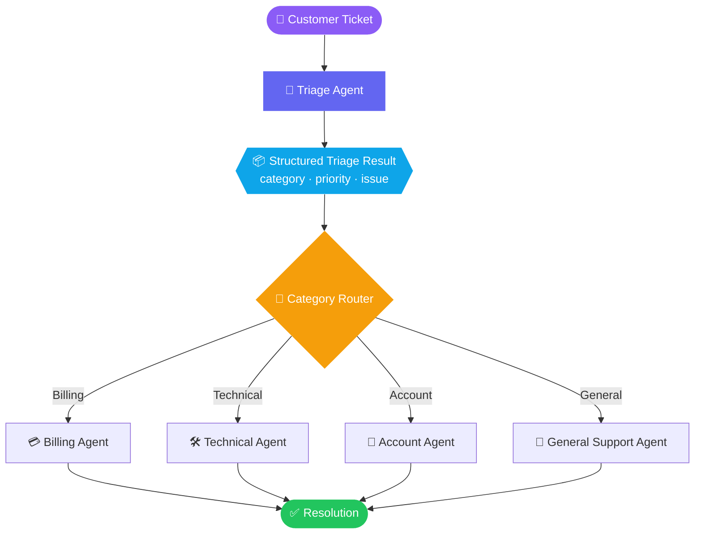
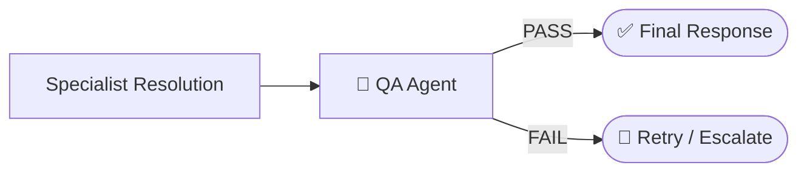
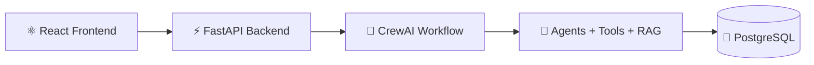
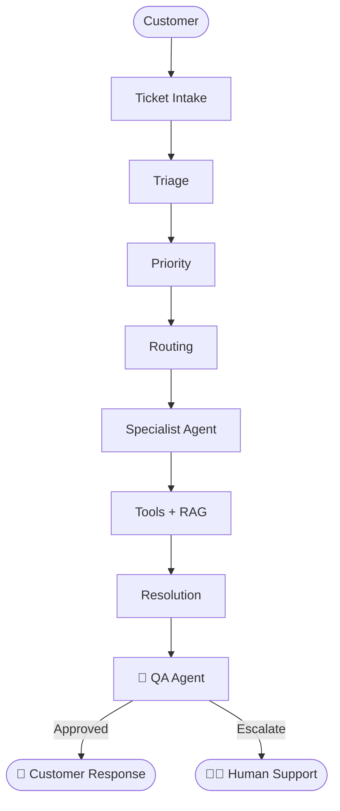

<div align="center">


<a href="https://github.com/Mahee0117/Ticket_resolver_crewai">
  
</a>

<br/>


**[Overview](#-overview)** · **[How it works](#-how-it-works)** · **[Agents](#-meet-the-crew)** · **[Quick start](#-quick-start)** · **[Roadmap](#-roadmap)**

</div>

---

## 📌 Overview

**SupportCrew AI** is an AI-powered customer support system built with **[CrewAI](https://www.crewai.com/)**.

A customer ticket comes in. A dedicated **Triage Agent** reads it, figures out *what kind of problem it is* and *how urgent it is*, then hands it to the **specialist agent** best suited to solve it.

> 💡 **Why multi-agent?** Instead of one general-purpose agent handling every request, each agent has one clear responsibility. Specialists give sharper, more focused answers.

### The questions it answers for every ticket

| ❓ Question | 🎯 Output |
|---|---|
| What type of issue is this? | `Billing` · `Account` · `Technical` · `General` |
| How urgent is it? | `Low` · `Medium` · `High` · `Urgent` |
| Who should handle it? | The matching specialist agent |

---

## 🧠 How it works



<table>
<tr>
<td width="25%" align="center"><h3>1️⃣</h3><b>Ticket arrives</b><br/><sub>A customer describes their problem in plain language</sub></td>
<td width="25%" align="center"><h3>2️⃣</h3><b>Triage</b><br/><sub>Category, priority and a short issue summary are extracted</sub></td>
<td width="25%" align="center"><h3>3️⃣</h3><b>Route</b><br/><sub>The category picks exactly one specialist to run</sub></td>
<td width="25%" align="center"><h3>4️⃣</h3><b>Resolve</b><br/><sub>The specialist writes a customer-friendly resolution</sub></td>
</tr>
</table>

### 🎬 Example run

**Input**

```text
The application crashes whenever I try to upload a PDF.
```

**Triage output**

```text
Category : Technical
Priority : High
Issue    : The application crashes whenever I try to upload a PDF.
```

**Routing**

```text
Technical  ──▶  Technical Agent  ──▶  Technical Task  ──▶  Resolution
```

<!--
📸 Add a terminal screenshot or GIF of a real run here, for example:
<p align="center"></p>
-->

---

## 🦸 Meet the crew

<table>
<tr>
<td width="20%" align="center"><h1>🔎</h1><b>Triage Agent</b><br/><sub><i>Senior Customer Support Triage Specialist</i></sub></td>
<td>
Classifies the ticket, assigns a priority, summarises the issue and routes it to the right specialist.<br/><br/>
<b>Categories:</b> <code>Billing</code> <code>Account</code> <code>Technical</code> <code>General</code><br/>
<b>Priorities:</b> <code>Low</code> <code>Medium</code> <code>High</code> <code>Urgent</code>
</td>
</tr>
<tr>
<td align="center"><h1>💳</h1><b>Billing Agent</b></td>
<td>Payments · Refunds · Duplicate charges · Subscriptions · Billing problems</td>
</tr>
<tr>
<td align="center"><h1>🛠️</h1><b>Technical Agent</b></td>
<td>Application crashes · Bugs · Errors · Technical failures · Troubleshooting</td>
</tr>
<tr>
<td align="center"><h1>👤</h1><b>Account Agent</b></td>
<td>Login problems · Password issues · Account access · Profile problems · Account security</td>
</tr>
<tr>
<td align="center"><h1>💬</h1><b>General Support Agent</b></td>
<td>General questions · Information requests · How-to questions · Basic customer assistance</td>
</tr>
</table>

---

## ✨ Features (v1.0)

- 🤖 **Multi-agent architecture** – specialised CrewAI agents instead of one do-everything agent
- 🧠 **Intelligent triage** – every ticket is classified into Billing, Account, Technical or General
- 🚦 **Priority classification** – Low, Medium, High or Urgent
- 📦 **Structured output** – triage results are validated with a Pydantic model
- 🧭 **Dynamic routing** – the triage category decides which specialist runs, and only that one
- 🔁 **Batch processing** – handle multiple tickets through a Python processing loop

```python
class TriageResult(BaseModel):
    category: str
    priority: str
    issue: str
```

---

## 🛠️ Tech stack

| Layer | Tools |
|---|---|
| 🐍 Language | Python |
| 🤝 Agent framework | CrewAI |
| ✅ Data validation | Pydantic |
| 🧠 LLM access | Hugging Face Inference Providers (OpenAI-compatible API) |
| 📦 Packaging | uv |
| 🔐 Config | python-dotenv |

---

## 📁 Project structure

```text
Ticket_resolver_crewai/
│
├── src/
│   └── supportcrew_ai/
│       ├── __init__.py
│       └── main.py
│
├── .env                # local secrets (never commit this)
├── .gitignore
├── .python-version
├── pyproject.toml
├── uv.lock
└── README.md
```

> ⚠️ `.env` is excluded from version control. Never commit real credentials to GitHub.

---

## 🚀 Quick start

**1. Clone the repository**

```bash
git clone https://github.com/Mahee0117/Ticket_resolver_crewai.git
cd Ticket_resolver_crewai
```

**2. Install dependencies**

```bash
uv sync
```

**3. Add your environment variables**

Create a `.env` file in the project root:

```env
HF_TOKEN=your_huggingface_token
```

**4. Run it**

```bash
uv run python src/supportcrew_ai/main.py
```

---

## 🗺️ Roadmap

SupportCrew AI is built **incrementally**. Each version adds one new agentic capability.

| Version | Milestone | Status |
|:---:|---|:---:|
| **v1.0** | Multi-agent triage and routing | ✅ **Done** |
| **v2.0** | QA Agent for resolution validation | 🗓️ Planned |
| **v3.0** | Human escalation | 🗓️ Planned |
| **v4.0** | Agent tools (real support data) | 🗓️ Planned |
| **v5.0** | RAG knowledge base | 🗓️ Planned |
| **v6.0** | CrewAI Flow orchestration | 🗓️ Planned |
| **v7.0** | Production application | 🗓️ Planned |

<details>
<summary>✅ <b>v1.0 – Multi-Agent Triage &amp; Routing</b> (completed)</summary>

<br/>

- Triage, Billing, Technical, Account and General Support agents
- Category and priority classification
- Pydantic structured output
- Category-based routing and specialist task execution
- Multiple ticket processing

</details>

<details>
<summary>🔵 <b>v2.0 – Resolution Validation</b> (planned)</summary>

<br/>

A dedicated **QA Agent** reviews every specialist response before it reaches the customer.



</details>

<details>
<summary>🟣 <b>v3.0 – Human Escalation</b> (planned)</summary>

<br/>

Escalate to a human for:

- High-risk security issues
- Complex unresolved tickets
- Failed QA validation
- Anything that needs human judgement

</details>

<details>
<summary>🟠 <b>v4.0 – Agent Tools</b> (planned)</summary>

<br/>

Specialists gain tools so they work with real support data instead of only the ticket text:

```python
get_customer()   get_order()   get_payment()   get_account()   search_logs()
```

</details>

<details>
<summary>🔴 <b>v5.0 – RAG Knowledge Base</b> (planned)</summary>

<br/>

Agents retrieve answers from company documentation using Retrieval-Augmented Generation.

**Potential sources:** FAQ documents · Refund policies · Account recovery docs · Product docs · Troubleshooting guides


</details>

<details>
<summary>🟡 <b>v6.0 – CrewAI Flow</b> (planned)</summary>

<br/>

Move routing and orchestration into a structured **CrewAI Flow**: Triage → Router → Specialists → Resolution → QA.

</details>

<details>
<summary>🚀 <b>v7.0 – Production Application</b> (planned)</summary>

<br/>



**Potential additions:** Authentication · Ticket database · REST APIs · Docker · Testing · Cloud deployment · Monitoring

</details>

---

## 🔭 Long-term vision

The goal is to grow SupportCrew AI from a multi-agent routing prototype into a complete **AI-powered customer support platform**.

> 🚧 Everything below the v1.0 line is a **plan, not a feature that exists today.**



---

## 📚 Learning journey

This project doubles as a hands-on way of learning CrewAI, built one layer at a time:

```text
Single Agent → Multiple Agents → Routing → Structured Outputs → QA
      → Tools → RAG → Workflow Orchestration → Full Application
```

Each version marks a new stage of understanding and implementation.

---

## 👨‍💻 Author

<div align="center">

**Mahesh M S K**
<br/>
<sub>Computer Science student · Agentic AI · Multi-Agent Systems · Generative AI · DevOps · Cloud · Full-Stack</sub>

<br/>

[](https://github.com/Mahee0117)
[](https://linkedin.com/in/msk-mahesh-98708829a)
[](https://portfolio-nu-sepia-sw11y787dc.vercel.app)

<br/>

**Current version: v1.0** · 🚧 Actively being developed

⭐ *If you find this project interesting, consider giving it a star!*


</div>